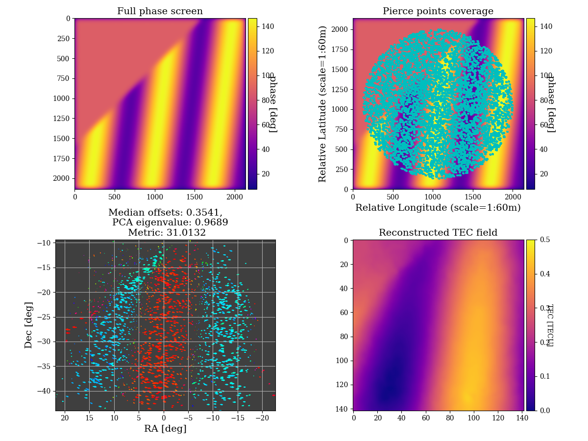

Tutorial
============

The key input to sivio is a CASA_ radio visibilities measurement set (MS).
For the MWA telescope you might need to provide a metafits file path for the observation as we will be grabbing a few parameters from 
it such as the observation time and the beam delays. However a functionality to download the metafits file directly from the MWA database will be added in coming versions.
If its an MS from a different telescope maybe soon we will make it easier for you to input those parameters.

.. _CASA: https://casa.nrao.edu/casadocs/casa-5.1.0/reference-material/measurement-set

Example
############################################################
An example full ``sivio`` run command would look like this.

.. code-block:: bash

    python sivio.py \
                --sim \
                -toimp \
                -r 25 \
                -n 5000 \
                -c 0.3 \
                --height 200000 \
                --tec_type s \
                --scale 100 \
                --spar 100 \
                --ms_template mset.ms \
                --metafits mset.metafits

A breakdown of the command is as follows:

- ``--sim`` - States that we are in simulation mode. Sometimes you might have simulated data already so you might want skip this argument and only do things like imaging, source matching and plotting.
- ``-topim`` - This is a combination of five arguments. You can just skip the argument for any unrequired functionality.

            - ``t`` - simulate true sky visibilities,
            - ``o`` - simulate offset visibilities, 
            - ``i`` - image using ``wsclean``, 
            - ``m`` - match sources, and,  
            - ``p`` - make plots.
- ``-r`` - Tells ``sivio`` to get sources from the GLEAM catalogue from that sky radius in degrees.
- ``-n`` - Total number of sources to be simulated.
- ``-c`` - Only simulate sources brighter than this flux density cutoff value.
- ``--height`` - Place the phase screen at this height in metres above the telescope.
- ``--tec_type`` - Type of phase screen to use. Can be ``s`` or ``k``:

        - ``s`` has ductlike structures as seen in the figure above, and, 
        - ``k`` is Kolmogorov-like turbulence.
- ``--scale`` - The pixel scaling for the set up. 100 means each pixel side will represent 100 metres in real space.
- ``--spar`` - Hyperparameter to tune the magnitude of ionospheric turbulence.
- ``--ms_template`` -  Path to the input measurement set.
- ``--metafits`` -  Path to the observation metafits file.

Outputs and what to expect
############################################################
The larger your ``n`` is, the longer the simulate will take as well as the memory based on the size of your input measurement set. 
We have tried to make the simulations quick based on your computation power, but as you might already know, visibilities simulations are quite computationally expensive. 
Or probably just start with a few hundred sources.

The above run would be expected to give the following outputs.

- A plot similar to the one below.

  Top left: The simulated ``s`` phase screen. Top right: The phase screen overlayed with pierce points for GLEAM sources 
  above 0.3Jy in a 25deg sky radius area centered at RA=0.0deg and Dec=-27.0deg.
  Bottom left: Vector offsets for each source. The color of an arrow represents the offset direction and its size is the magnitude of the offset. 
  The values on this plot quantify the level of ionospheric turbulent with a quality assurance metric. Bottom right: Reconstructed TEC from the vector offsets.

- A measurement set with either or both a ``DATA`` and ``OFFSET_DATA`` columns. The columns contain the true and the contaminated visibilities respectively.
- The sky model source list used for the simulation in the ``RTS-sourcelist`` format.
- A ``.npz`` file with the phase screen array used for the simulation.
- A ``.npz`` file with all the pierce-points computed per array towards each direction.
- Fits images from ``wsclean`` for both the true and offset data with their backgrounds and rms fits files computed using ``aegean`` which is used to do the source finding in both.
- Both true and offset sky catalogues as produced by ``aegean``.
- Sorted true and offset catalogues with matching sources.

And there you are! Have fun with the simulated data.

